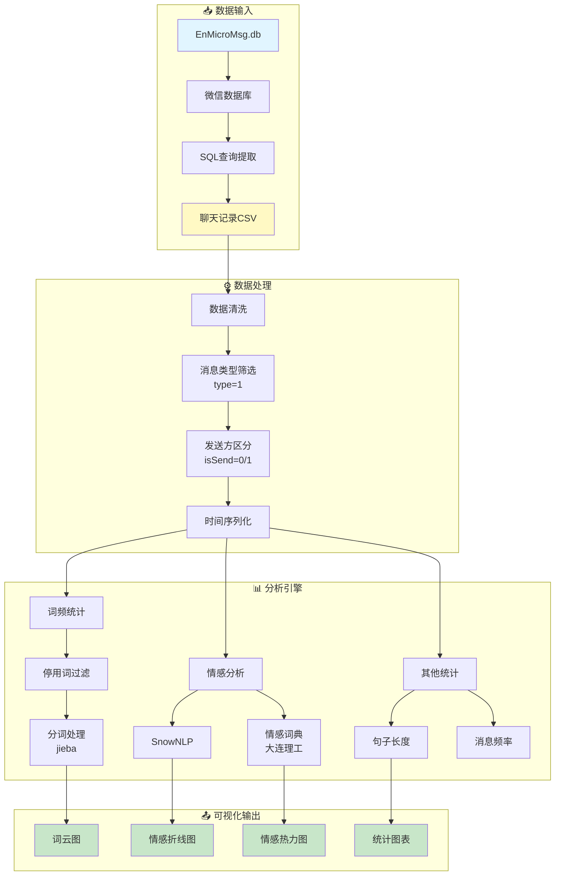
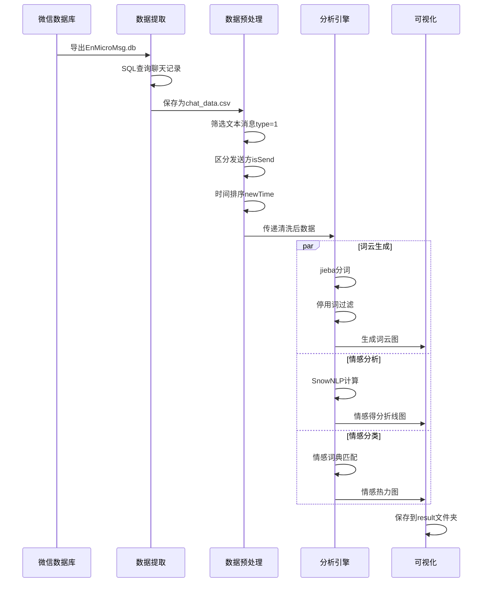

# 📊 fork-wechat_analysis - 微信聊天记录分析工具


## 📖 项目简介

fork-wechat_analysis是微信聊天记录文本分析工具,支持词频统计、情感分析、消息频率分析等功能,帮助用户深入了解聊天内容。

## 📦 项目来源

- **原项目**: 未知(待确认)
- **原作者**: 未知
- **开源协议**: 未明确标注(需查看原项目)
- **Fork时间**: 2024年

## 🔧 二次开发内容

本项目为原项目的学习研究版本,主要用于:
- 学习自然语言处理技术
- 研究情感分析和文本挖掘方法
- 了解数据可视化的实现技术

## ⚠️ 免责声明

本项目仅供学习研究使用,请勿用于非法用途。使用本项目所产生的一切后果由使用者自行承担。

## 系统架构 | System Architecture



## 分析流程 | Analysis Pipeline



## 情感分析模块 | Sentiment Analysis

```mermaid
mindmap
  root((情感分析))
    SnowNLP方法
      情感得分
        0-1区间
        中性判断
      时间序列分析
        月度均值
        趋势变化
    情感词典方法
      大连理工词典
        7大情绪类别
        词语情感强度
      情绪分类
        乐、好、怒
        哀、惧、恶、惊
      热力图展示
        月份×情绪
        颜色深浅表示强度
    可视化输出
      折线图
        情感得分趋势
      热力图
        情绪分布矩阵

## 📊 系统架构

```mermaid
flowchart TB
    subgraph DataSource["📥 数据源"]
        WeChat["微信数据库<br/>EnMicroMsg.db"]
        Export["数据导出<br/>chat_data.csv"]
    end
    
    subgraph Preprocess["🔧 数据预处理"]
        Filter["数据筛选<br/>type=1"]
        Clean["数据清洗<br/>停用词过滤"]
        Seg["中文分词<br/>jieba"]
    end
    
    subgraph Analysis["📊 情感分析"]
        SnowNLP["SnowNLP<br/>情感得分"]
        Dict["情感词典<br/>大连理工本体"]
        Heat["热力图<br/>情感分类"]
    end
    
    subgraph Visualization["🎨 可视化"]
        WordCloud["词云生成<br/>wordcloud"]
        LineChart["折线图<br/>情感趋势"]
        Stats["统计分析<br/>其他统计"]
    end
    
    subgraph Output["📁 输出结果"]
        Images["图片结果<br/>PNG格式"]
        CSV["分析数据<br/>CSV文件"]
    end
    
    DataSource --> Preprocess
    Preprocess --> Analysis
    Analysis --> Visualization
    Visualization --> Output
    
    WeChat --> Export
    Export --> Filter
    Filter --> Clean
    Clean --> Seg
    
    Seg --> SnowNLP
    Seg --> Dict
    SnowNLP --> LineChart
    Dict --> Heat
    Seg --> WordCloud
    
    WordCloud --> Images
    LineChart --> Images
    Heat --> Images
    
    classDef sourceStyle fill:#e3f2fd,stroke:#1565c0,stroke-width:2px
    classDef preStyle fill:#fff3e0,stroke:#f57c00,stroke-width:2px
    classDef analysisStyle fill:#f3e5f5,stroke:#7b1fa2,stroke-width:2px
    classDef vizStyle fill:#e8f5e9,stroke:#388e3c,stroke-width:2px
    classDef outputStyle fill:#fce4ec,stroke:#c2185b,stroke-width:2px
    
    class WeChat,Export sourceStyle
    class Filter,Clean,Seg preStyle
    class SnowNLP,Dict,Heat analysisStyle
    class WordCloud,LineChart,Stats vizStyle
    class Images,CSV outputStyle
```

## 项目结构、所需数据
    --data  存放分析所需的数据
        --EnMicroMsg.db     从微信中导出的聊天记录数据库
        --chat_data.csv     将数据库中的聊天记录存储到csv文件，之后分析都从csv读取数据
        --大连理工大学中文情感词汇本体.xlsx   情感词典
        --CNstopwords.txt   中文停用词
        --simhei.ttf        绘制词云指定的字体

    --result 存放分析结果、生成的图片
    
    --gernerate_word_cloud.py   生成词云
    
    --sentiment_snownlp.py      调用snownlp生成情感得分，计算情感均值、作折线图

    --sentiment_dict.py         使用大连理工情感词典计算情绪分类，作热力图
    
    --others.py                 其他统计
 

## 具体步骤
### 1. 导出聊天记录
    参考以下两个博客：
    ① https://blog.csdn.net/weixin_41746317/article/details/104110161?spm=1001.2101.3001.6650.5&utm_medium=distribute.pc_relevant.none-task-blog-2%7Edefault%7EOPENSEARCH%7ERate-5-104110161-blog-126700288.pc_relevant_multi_platform_whitelistv3&depth_1-utm_source=distribute.pc_relevant.none-task-blog-2%7Edefault%7EOPENSEARCH%7ERate-5-104110161-blog-126700288.pc_relevant_multi_platform_whitelistv3&utm_relevant_index=6
    ① https://blog.csdn.net/m0_59452630/article/details/124222235
    破译密码如果①的方法没成功可以试试②的

    content列：聊天内容
    type列：信息类型（1代表文本消息，需要用excel筛选一下之后只分析type=1的数据）
    isSend列：0代表对方发送的信息，1代表自己发送的信息
    createTime：时间（暂时不知道怎么恢复成年月日），但是降序排序以后的顺序是聊天记录由近到远的顺序
    自己加了一列newTime，记录聊天记录所在月份，是根据createTime降序排序后，手机上看每月最后几句信息，在excel中搜索，来进行月份划分的
    
   
    
    
### 2. 生成词云
    调用generate_word_cloud.py
   
   

### 3. 计算情感得分均值，作折线图（使用snownlp）
    ① 调用get_sentiment_score()函数，将情感得分保存到csv的sentiment_score列中
    ② 调用draw()函数，将情感得分随时间变化值保存到result文件夹中
    
    snownlp得到的分值不一定准确，所以send和receive的得分值都差不多，但也有可能日常的交流就是比较中性的，没有什么大起大落的情感
   


### 4. 计算情绪分类，作热力图（使用大连理工情感词典）
    调用sentiment_dict.py
    注意第115行，如果没有匹配到任何情感词，就记为None，绘制热力图的时候会筛掉None的记录
   

### 5. 其他统计绘图
    others.py
   


    
    
    

